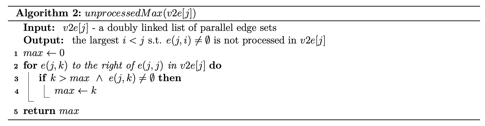

<!-- # Linear-Time Selective Reduction -->

[Pawel Winter](https://dl.acm.org/doi/10.1007/BF01939361) found a way to enumerate all spanning trees in a simple connected graph $G(V, E)$ without repetition. The algorithm runs in $O(n + m + t \cdot n)$ where $t$ is the number of spanning trees and $n = |V|, m = |E|$. 

## Proper Labeling

The enuemration algorithm requires a preprocessing that *properly labels* the vertices such that any subgraph $G_k$ containing the first $k$ vertices $\{v_1, \dots, v_k\}$ is connected. The figure below shows a *properly labeled* graph $G(V, E)$ where $G_2$, $G_3$ and $G_4$ are connected.

## To be, or not to be, that is the recursion

The algorithm recursively makes decision on whether to include an edge in the spanning tree. Each decision about an edge $e$ leads to two mutually exclusive sets of spanning tree, a set of trees with $e$ and the other without it.

Once the graph is *properly labeled*, the algorithm starts the decision making from the highest numbered vertex (5 in our example) as shown below.

The set of spanning trees $T_1$ all contains the edge $h$, while the set $T_2$ doesn't.
The exclusion of $h$ from the spanning tree requires $f$ **to be** a part of any spanning tree in $T_2$.

So at each vertex $j$, this **to-be-or-not-to-be** decision breaks down to two aspects.
1. To include the edge $(j, i)$ where $i < j$
2. To exclude all the edges $(j, k)$ where $k \in (i, j)$

## Decision modeled as Contraction

The decision sequence is modeled as a series of contractions, where each concerns a vertex from $n$ to $2$.

Let's consider the example below where the first decison to include $h$ would translate to a contraction from 5 to 4, while leaving out the edge to include, $h = (5, 4)$, and all edges to exclude, $(5, k)$ s.t. $k\in (4, 5)$, which is none here.
After the contraction, the edge $f = (5, 2)$ becomes $f = (4, 2)$ and is still available for selection. 
<!--  -->
The second decision to include $f = (4, 2)$ means a contraction from 4 to 2, where no edge to exclude eitherl
The third decision to include $a = (3, 1)$ means a contraction from 3 to 1, while $b = (3, 2)$ is the edge to exclude.
The final decision to include either $c = (2, 1)$ or $d = (2, 1)$ means a contraction from 2 to 1.

A contraction process generates some intermediate multigraphs. Each twofold decision now becomes,
1. To include all the parallel edges $(j, i)$ where $i < j$
2. To exclude all the parallel edges $(j, k)$ where $k \in (i, j)$

The process eliminates a vertex at a time in a descending order. The example above goes like 
$5 \rightarrow 4, 4 \rightarrow 2, 3 \rightarrow 1, 2 \rightarrow 1$.
As the sources of contraction are always $n, n-1, \dots, 2$, the process can be compactly expressed with
the targetss, like $4, 2, 1, 1$.

We use $G^4$ to denote the multigraph after contracting 5 to 4 and $G^{4, 2, 1, 1}$ to denote the empty graph after contracting vertices one by one following the process above. 

The decision tree of contraction process would look something like the one below.

The cartesian product of all sets of parallet edges from the root $G$ to the leaf $G^{4, 2, 1, 1}$ are the spanning trees generated by this contraction process, one with edges $h, f, a, c$ and the other with $h, f, a, d$.

### Higher Degree, Lower Number, Shorter Delay

The decision tree above shows that the enumeration delay is minimized when it branches out towards the bottom.
So it is desirable to assign smaller numbers to vertices with higher degrees during
the *proper labeling*.

## Contraction Algorithm

The preprocessing *properly labels* the vertices and generates the following.

$v2e$ is a vertex-to-edge mapping, namely an array of pointers, mapping the integer ID of a vertex
to a set of parallel edges connecting to vertices with smaller IDs. 
Each element of the array points to a doubly linked list.
The example below $v2e[3]$ points to a doubly linked list of parallel edges from the vertex 3 to the vertices 1 and 2. There is always a placeholder $e(j, j) \in v2e[j]$ like $e(3, 3)$.
$$
\begin{aligned}
v2e[3] = e(3, 3) \leftrightarrow e(3, 1) \leftrightarrow e(3, 2)
\end{aligned}
$$

Given a multigraph $G(V, E)$, the size of $v2e$ equals the number of vertices, $|v2e| = |V|$.
Each element $v2e[j]$ has the following attributes.
- $v2e[j].head$ : the head of the doubly linked list
- $v2e[j].tail$ : the end of the doubly linked list

The doubly linked list is not necessarily sorted, but the placeholder is always initialized to the head $v2e[j].head = e(j, j)$.

$e(j, i)$ is a set of parallel edges between the vertices $j$ and $i$, where $j > i$.
For example, $e(3, 2) = \{a, b\}$ comprises 2 parallel edges between 3 and 2. 
Each parallel edge set has the following attributes.

-  $e.j$ : the end vertex of $e$ with larger ID
-  $e.i$ : the end vertex of $e$ with smaller ID
-  $e.ids$ : a set of alphabetic/integer IDs of the parallel edges
-  $e.prev$ : the previous item in the linked list $v2e[j]$
-  $e.next$ : the next item in the linked list $v2e[j]$

There is also an $n \times n$ matrix where each element in cell $(j, i)$ is a pointer to $e(j, i)$ in the linked list $v2e[j]$ to facilitate fast access of the parallel edge sets.

The recursive algorithm is shown below.

Provided that $res$ is passed down by reference in the recursion, it is an any-time algorithm such that $res$ contains all the spanning trees countered so far.

The helper to find the target vertex to contract to is shown below.

