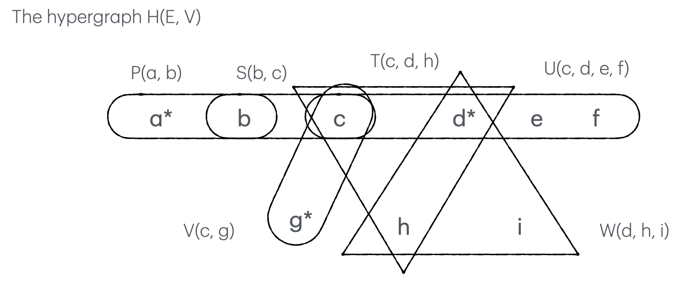
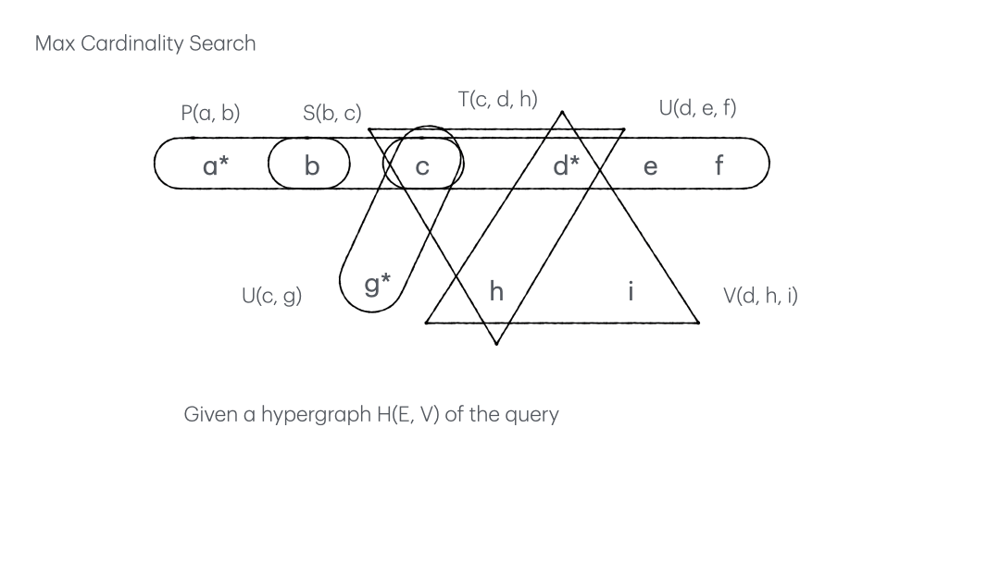
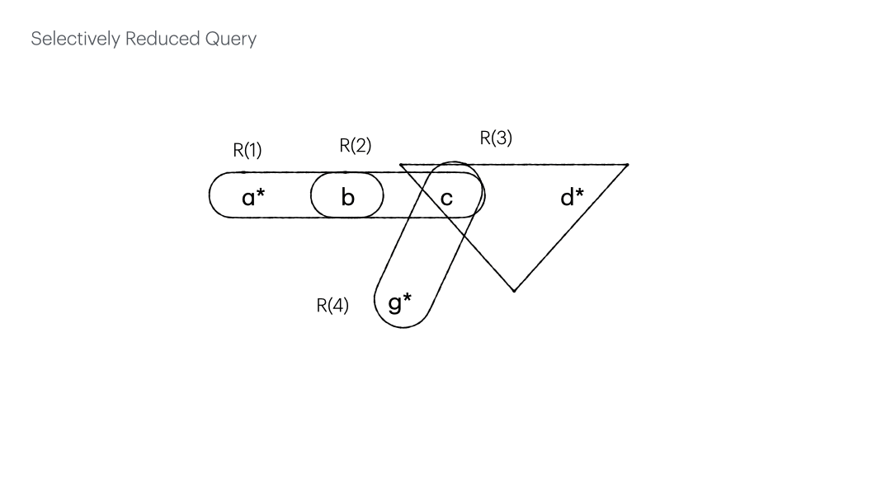

# Linear-Time Selective Reduction

A query may contain many more relations and variables than what we want
in the final result and also than the ones needed for join and aggregation.
Selective reduction is a process to trim away the irrelevant while evaluating a query.
[Tarjan and Yannakakis](https://epubs.siam.org/doi/pdf/10.1137/0213035?casa_token=8trfYbJJPTwAAAAA:2hLSM554LzEGVwoaFr_Kbg9i1D12Ti4fzmmEVXU0mCqGeVUolpXE7vrsK4Bz7JM5zkT6ilrTUP1v)
came up with a linear-time solution for acyclic queries.

More specifically, their algorithm selectively reduce an acyclic query of $n$ variables and $m$ relations
in $O(n + m)$. 

## Query as Hypergraph

Let's consider an acyclic query $Q(a, d, g) = P(a, b), S(b, c), T(c, d, h), U(c, d, e, f), V(c, g), W(d, h, i)$ 
where $a, d, g$ are *free variables* we'd like to see in the query result. 
All others are *bound variables*.
We can derive a hypergraph as shown below from it by regarding each variable as a vertex and each relation as a hyperedge.

Selective reduction gives $Q(a, d, g) = P(a, b), S(b, c), V(c, g), \Pi_{c,d}T, \Pi_{c, d}U, \Pi_{d}W$ as shown below.
<!--  -->

The linear-time selective reduction achieves this in 2 steps. First, **Max Cardinality Search**,
then, **Repetitive Reduction**.

## Max Cardinality Search

To prepare for the reduction, 
Tarjan and Yannakakis found it neccesary to first number everything and proposed an algorithm, Max Cardinality Search (MCS). 
The algo numbers the vertices in a decending order,
and simultaneously number the hyperedges in an ascending order.

The animated figure below shows the very beginning of an MCS, which starts by picking a free variable, say $a$, 
and considers the hyperedge containing it as the 'selected' edge at the moment. 
So the edge $P(a, b)$ is numbered as the 1st edge, $R(1)$, and $a$ is assigned the largest number equivalent to the number of vertices, 9. At any point of the process, $i$ in the parenthese of $R(i)$ can be interpreted as 
the 'time stamp' of when an edge is selected. The smaller, the earlier.

MCS proceeds to number all vertices in the selected hyperedge. Here, $b$ is numbered 8. 
For we only need the numbering of edges in the end, the order of vertex numbers in an edge does not really matter. 
Any permuation works.

The numbering of $R(1)$ is done when all of its vertices have been checked. 

We take a quick pause after numbering each edge to calculate two 
key measurements useful in the later reduction process.
- $|R(1)| = 2$ says there are 2 vertices in the 1st numbered edge.
- $|R(1)| = 0$ says that none of them has been numbered before the 1st edge is selected by us.

While numbering $R(1)$, we number the vertex $b$ that also appears in another edge $S(b, c)$.
We increment the priority of $S(b, c)$ by 1. Notice that the numbering of each vertex might increase the priorities of multiple edges.

We proceed to number the edge with the highest priority, $R(2).

<!--  -->

In case that two or more edges have the highest priority, we break ties by cardinality
(largest edge preferred).
As we can see in the animated figure below, 
the numbering of $c$ increases the priorities of multiple edges, namely
$T(c, d, h)$, $V(c, g)$ and $U(c, d, e, f)$, all to 1.
The largest, $U(c, d, e, f)$, is selected as $R(3)$.

<!--  -->

We repeat the above process until all vertices and edges are numbered as shown below.

<!--  -->

## Repetitive Reduction

Given a fully numbered hypergraph by the Max Cardinality Search, we carry out the selective reduction by
repeating the following 3-step procedure:
1. Delete any *bound variable* that belongs to exactly one edge
2. Update $|R(i)|$ accordingly
3. Delete any $R(i)$ s.t. $|R(i)| = |R'(i)|$ or $|R(i)| = |R'(i+1)|$

In the 1st round shown below, we can immediately (1) delete $e, f \in R(3)$ and $i \in R(5)$, each appearing in exactly one edge. Then we shall (2) update the corresponding $|R(3)| \leftarrow 2$ and $|R(5)| \leftarrow 2$ to reflect their up-to-date cardinality after deletion. (3) While looking for $|R(i)| = |R'(i)|$ or $|R(i)| = |R'(i+1)|$, we find two candidates,

- $|R(3)| = |R'(4)|$
- $|R(5)| = |R'(5)|$

Let's delete them one by one following a descending order of time stamp, starting with $R(5)$. The deletion creates a void in the time stamp sequence, between $R(4)$ and $R(6)$, and may reduce $|R'(6)|$. In this case, $|R(5)| - |R'(5)| = 0$ says that every vertex in it has been numbered by its previous edges. So the deletion does not reduce $|R'(6)|$. To fill in the void, we decrement the time stamp of $R(6)$ by 1, making it the new $R(5)$. We repeat the same drill for $R(3)$. $|R(3)| - |R'(3)| = 1$ says that 1 vertex is numbered at time stamp $3$. Due to the void after the deletion, we shall give the credit of every vertex numbered at both time stamp $3$ and $4$ to $R(4)$. To fill the void again, we decrement $R(4)$, $R(5)$ to $R(3)$, $R(4)$. And there was deletion, and there was update - the 1st round.

<!--  -->

We repeat the 3-step process in the 2nd round shown below and stop before going very far, as we can only (1) delete $h \in R(3)$ and (2) update $R(3)$. No edge satisfies the condition $|R(i)| = |R'(i)|$ or $|R(i)| = |R'(i+1)|$. And there was deletion, and there was update - the 2nd round. As we can't proceed any further, we conclude the selective reduction process here.

By putting back all the relations (edges) which can be projected onto the existing variables (vertices), we have the selectively reduced query.

<!--  -->
